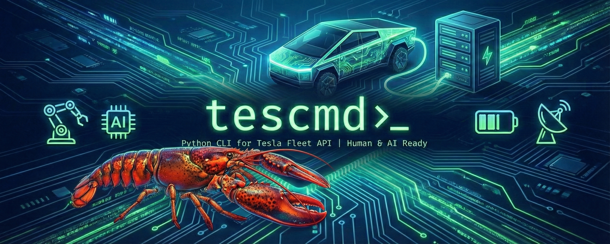
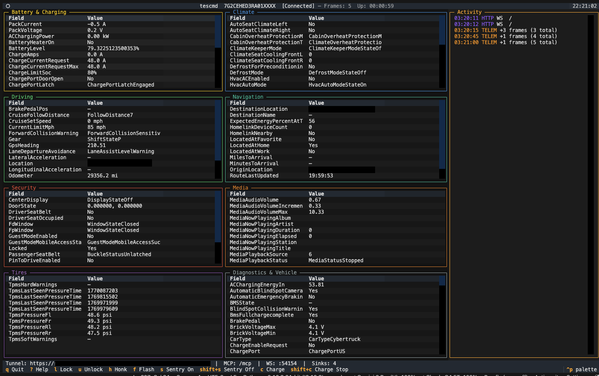
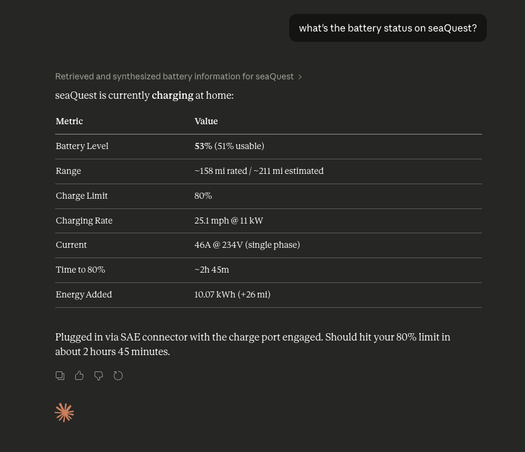
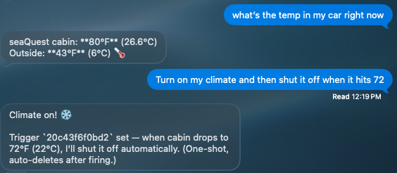
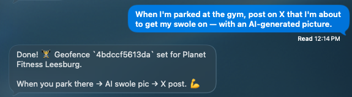
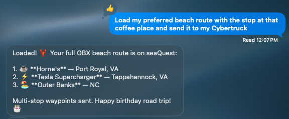
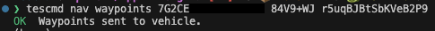
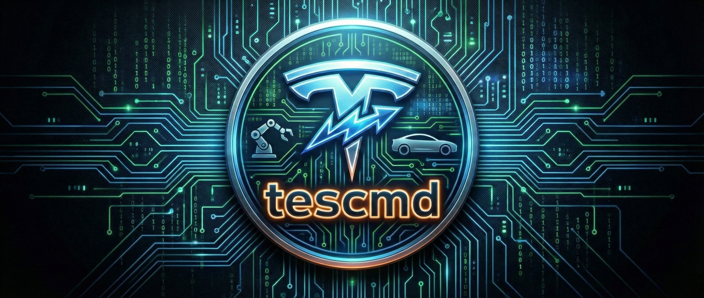

<p align="center">
  
</p>

# tescmd

<p align="center">
  <a href="https://pypi.org/project/tescmd/"></a>
  <a href="https://pypi.org/project/tescmd/"></a>
  <a href="https://github.com/oceanswave/tescmd/actions/workflows/test.yml"></a>
  <a href="LICENSE"></a>
  <a href="https://github.com/oceanswave/tescmd/releases"></a>
</p>

<p align="center">
  <strong>The complete Python CLI for Tesla's Fleet API — built for humans and AI agents alike.</strong>
</p>

<p align="center">
  Check your battery. Lock your doors. Stream live telemetry. Let Claude control your car.<br>
  Two commands to install. One wizard to set up. Every API endpoint at your fingertips.
</p>

---

## Quick Start

```bash
pip install tescmd
tescmd setup
```

The setup wizard handles everything — Tesla Developer app creation, key generation, public key hosting, Fleet API registration, OAuth2 authentication, and vehicle key enrollment. Then you're ready:

```bash
tescmd charge status               # Battery and charging state
tescmd climate on --wake            # Turn on climate (wakes if asleep)
tescmd security lock --wake         # Lock the car
tescmd nav waypoints "Home" "Work"  # Multi-stop navigation
tescmd serve 5YJ3...               # Launch the live dashboard
```

---

## See It in Action

### Live TUI Dashboard

`tescmd serve` launches a full-screen terminal dashboard with real-time telemetry, MCP server status, tunnel info, and connection metrics — powered by Textual.

<p align="center">
  
</p>

### AI Agent Integration

Every command doubles as an MCP tool. Claude Desktop, Claude Code, and other agent frameworks can query your vehicle, send commands, and react to telemetry — all through structured JSON with built-in cost protection.

<p align="center">
  
</p>

<p align="center">
  
</p>

<p align="center">
  
</p>

<p align="center">
  
</p>

### Rich Terminal Output

Formatted tables in your terminal, structured JSON when piped — tescmd auto-detects the right output for the context.

<p align="center">
  
</p>

---

## What You Get

### Query & Control

Full read/write access to Tesla's Fleet API: battery, charge, climate, locks, trunks, windows, sentry, navigation, media, speed limits, PINs, Powerwalls, and more. Every read command is cached with smart TTLs — bots can call tescmd as often as they want and only pay for the first request.

### Fleet Telemetry Streaming

Your vehicle pushes data directly to your machine via Tailscale Funnel — no polling, no per-request charges. Choose from field presets (`driving`, `charging`, `all`) or subscribe to 120+ individual fields. Sessions produce a wide-format CSV log by default.

```bash
tescmd serve 5YJ3... --fields driving     # Speed, location, power
tescmd serve 5YJ3... --fields all         # Everything
```

### MCP Server for AI Agents

`tescmd serve` exposes every command as an MCP tool with OAuth 2.1 authentication. Agents get deterministic JSON output, meaningful exit codes, and a `--wake` opt-in flag so they never trigger billable wake calls by accident.

### OpenClaw Bridge

Stream filtered telemetry to an [OpenClaw](https://openclaw.ai/) Gateway with per-field delta and throttle filtering. Bots on the gateway can send commands back — lock doors, start charging, set climate — through bidirectional dispatch.

### Trigger Subscriptions

Register conditions on any telemetry field — battery below 20%, speed above 80, location enters a geofence — and get notified via OpenClaw push events or MCP polling. Supports one-shot and persistent modes with cooldown.

### Signed Vehicle Commands

tescmd implements the [Vehicle Command Protocol](https://github.com/teslamotors/vehicle-command) with ECDH session management and HMAC-SHA256 signing. Once your key is enrolled, commands are signed transparently — no agent-side crypto needed.

---

## Cost Protection Built In

Tesla's Fleet API is pay-per-use. A naive polling script can generate hundreds of dollars in monthly charges from a single vehicle. tescmd implements four layers of defense:

| Layer | What it does |
|---|---|
| **Tiered caching** | Specs cached 1h, fleet lists 5m, standard queries 1m, location 30s |
| **Wake confirmation** | Prompts before billable wake calls; `--wake` flag for scripts |
| **Smart wake state** | Tracks recent wake confirmations, skips redundant attempts |
| **Write invalidation** | Write commands auto-invalidate the relevant cache scope |

Streaming telemetry via `tescmd serve` replaces polling entirely — flat cost regardless of data volume. See [API Costs](docs/api-costs.md) for the full breakdown.

---

## Commands

| Group | Description |
|---|---|
| `setup` | Interactive first-run wizard |
| `auth` | OAuth2 login, logout, token management, export/import |
| `vehicle` | State queries, wake, rename, telemetry streaming, fleet status |
| `charge` | Charge control, scheduling, departure, fleet management |
| `climate` | HVAC, seats, steering wheel, bioweapon defense, overheat protection |
| `security` | Lock/unlock, sentry, valet, PINs, speed limits, remote start |
| `trunk` | Trunk, frunk, windows, sunroof, tonneau |
| `media` | Playback control, volume, favorites |
| `nav` | Send destinations, GPS coordinates, multi-stop waypoints, HomeLink |
| `software` | Update status, scheduling, cancellation |
| `energy` | Powerwall status, backup reserve, storm mode, grid config, history |
| `billing` | Supercharger billing history and invoices |
| `user` | Account info, region, orders, feature flags |
| `sharing` | Driver management, vehicle sharing invites |
| `key` | Key generation, deployment, enrollment, validation |
| `serve` | Combined MCP + telemetry + OpenClaw TUI dashboard |
| `mcp` | Standalone MCP server |
| `openclaw` | Standalone OpenClaw bridge |
| `cache` | Cache status and management |
| `raw` | Direct Fleet API endpoint access |

Every command supports `--format json` for scripting and `--help` for detailed usage. See the [Command Reference](docs/commands.md) for the full list.

---

## Installation

```bash
pip install tescmd
```

**Requirements:** Python 3.11+ and a [Tesla account](https://www.tesla.com) with a linked vehicle or energy product.

**Recommended:** [GitHub CLI](https://cli.github.com) (`gh`) for automated key hosting via GitHub Pages, or [Tailscale](https://tailscale.com) for zero-config key hosting and telemetry streaming via Funnel.

<details>
<summary>Install from source</summary>

```bash
git clone https://github.com/oceanswave/tescmd.git
cd tescmd
pip install -e ".[dev]"
```

</details>

---

## Configuration

tescmd resolves settings from CLI flags, environment variables (`.env` files loaded automatically), and defaults — in that order.

<details>
<summary>Environment variables</summary>

```dotenv
TESLA_CLIENT_ID=your-client-id
TESLA_CLIENT_SECRET=your-client-secret
TESLA_VIN=5YJ3E1EA1NF000000
TESLA_REGION=na                    # na, eu, cn

# Display units (optional — defaults to US)
TESLA_TEMP_UNIT=F                  # F or C
TESLA_DISTANCE_UNIT=mi             # mi or km
TESLA_PRESSURE_UNIT=psi            # psi or bar

# Or switch everything at once:
#   tescmd --units metric charge status
```

See [docs/commands.md](docs/commands.md) for the full environment variable reference.

</details>

<details>
<summary>Token storage</summary>

Tokens are stored in the OS keyring by default (macOS Keychain, GNOME Keyring, Windows Credential Manager). On headless systems, tescmd falls back to a file-based store with restricted permissions. Transfer tokens between machines with `tescmd auth export` and `tescmd auth import`.

</details>

---

## Documentation

| | |
|---|---|
| [Setup Guide](docs/setup.md) | Step-by-step walkthrough of `tescmd setup` |
| [Command Reference](docs/commands.md) | Detailed usage for every command |
| [API Costs](docs/api-costs.md) | Cost breakdown, savings calculations, streaming comparison |
| [Bot Integration](docs/bot-integration.md) | JSON schema, exit codes, headless auth |
| [OpenClaw Bridge](docs/openclaw.md) | Gateway protocol, bidirectional commands, triggers, geofencing |
| [MCP Server](docs/mcp.md) | Tool reference, OAuth 2.1, custom tools, trigger polling |
| [Vehicle Command Protocol](docs/vehicle-command-protocol.md) | ECDH sessions and signed commands |
| [Authentication](docs/authentication.md) | OAuth2 PKCE flow, token storage, scopes |
| [Architecture](docs/architecture.md) | Layered design, module responsibilities |
| [FAQ](docs/faq.md) | Common questions about costs, hosting, and configuration |
| [Development](docs/development.md) | Contributing, testing, linting |

---

## Development

```bash
git clone https://github.com/oceanswave/tescmd.git && cd tescmd
pip install -e ".[dev]"
pytest                             # 1600+ tests
ruff check src/ tests/ && mypy src/
```

---

## Changelog

See [CHANGELOG.md](CHANGELOG.md) for release history.

## License

MIT

<p align="center">
  
</p>
